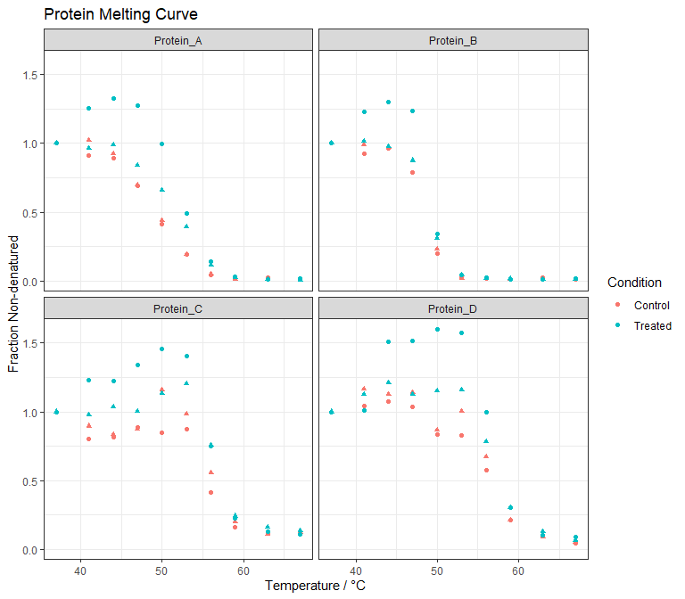
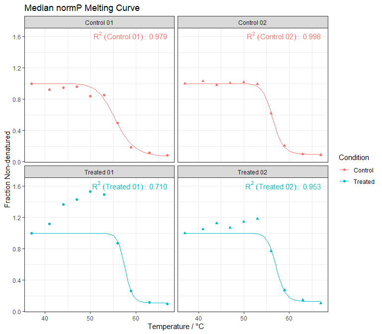
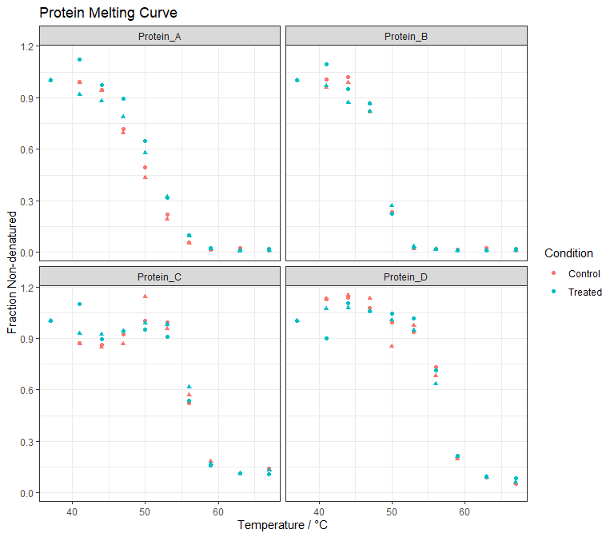
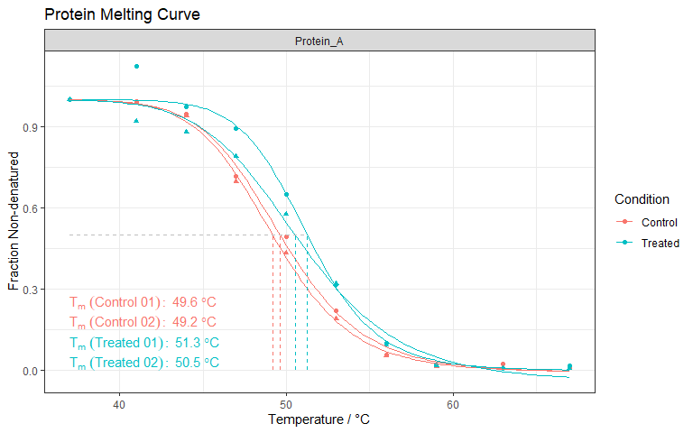

<!-- README.md is generated from README.Rmd. Please edit that file -->

# tidyTPP

<!-- badges: start -->

[](https://app.codecov.io/gh/jackrogan/tidyTPP)
[](https://github.com/jackrogan/tidyTPP/actions/workflows/R-CMD-check.yaml)
<!-- badges: end -->

tidyTPP provides an analysis pipeline for *Thermal Protein Profiling
(TPP)* proteomics data, with functions for reading in data from protein
quantification software, normalising data, analysis, and hit-finding.

The goal of tidyTPP is to provide a range of functions, each of which
requires data in a straightforward data frame or
[tibble](https://tibble.tidyverse.org/) and returns long-format data in
a [tibble](https://tibble.tidyverse.org/) that are readily understood
and easily used for further analysis. The style of data is inspired by
the [tidyverse](https://www.tidyverse.org/), and tidyTPP makes use of
several tidyverse packages - in particular
[tibble](https://tibble.tidyverse.org/) and
[ggplot2](https://ggplot2.tidyverse.org/).

### Currently supports:

Importing:

- Importing from *Thermo* Proteome Discoverer

- Importing from Spectronaut

- Importing with custom settings

Normalisation and Analysis:

- Single- and multi-threaded fitting of temperature-dependent protein
  melting curves *(TPP-TR)*

- Significance scores by melting point difference ($\Delta T_m$)

- Significance scores by *non-pararametric analysis of response curves
  (NPARC)*

Hit-finding

- Identifying hits by $\Delta T_m$ p-value

- Identifying its by *NPARC* F-score and p-value

Plotting

- Plotting *TPP-TR* melting-curves with
  [ggplot2](https://ggplot2.tidyverse.org/)

## Installation

You can install the development version of tidyTPP from
[GitHub](https://github.com/) with:

``` r
# install.packages("pak")
pak::pak("jackrogan/tidyTPP")
```

## Example

This example will walk through the main functions using 2-protein
example data

``` r
# Import package
library(tidyTPP)
```

### Import

*import\_* functions read two files - quantification results output in a
program-specific format, and a configuration file, defining conditions,
replicates and temperatures, in the format shown.

``` r
# 2-protein example data
two_prot_report <-
    system.file("extdata", "normP_report.csv", package = "tidyTPP")
experiment_config <-
    system.file("extdata", "ATIC_config.csv", package = "tidyTPP")

# Config file contents
read.csv(experiment_config)[1:10,]
#>    Experiment Condition Replicate Temp
#> 1           1   Control         1   37
#> 2           2   Control         1   41
#> 3           3   Control         1   44
#> 4           4   Control         1   47
#> 5           5   Control         1   50
#> 6           6   Control         1   53
#> 7           7   Control         1   56
#> 8           8   Control         1   59
#> 9           9   Control         1   63
#> 10         10   Control         1   67

# Import using spectronaut import format
two_prot_quan_data <- 
  import_spectronaut(datafile = two_prot_report,
                     config = experiment_config)
#> 
#> --------------------
#> TPP Data Import
#> --------------------
#> Read in:
#> C:/Users/jr2020/AppData/Local/Temp/RtmpoPSJxM/temp_libpath26c44d25233d/tidyTPP/extdata/normP_report.csv 
#> C:/Users/jr2020/AppData/Local/Temp/RtmpoPSJxM/temp_libpath26c44d25233d/tidyTPP/extdata/ATIC_config.csv 
#> --------------------
#> Pivoting to long table...
#> Transforming experiment names...
#> Matching to experiment config data...
#> Finding relative quantity values...
#> Data imported.
#> Found 2 proteins.
#> --------------------

# Resulting tibble
two_prot_quan_data
#> # A tibble: 80 × 8
#>    Protein_ID Pep_N Match_N Condition Replicate  Temp rel_quantity raw_quantity
#>    <chr>      <dbl>   <dbl> <chr>     <chr>     <int>        <dbl>        <dbl>
#>  1 ATIC          36      62 Control   01           37      1           7913466.
#>  2 ATIC          36      62 Control   01           41      0.915       7238843 
#>  3 ATIC          36      62 Control   01           44      0.895       7083090 
#>  4 ATIC          36      62 Control   01           47      0.689       5454540.
#>  5 ATIC          36      62 Control   01           50      0.416       3291901 
#>  6 ATIC          36      62 Control   01           53      0.195       1542812.
#>  7 ATIC          36      62 Control   01           56      0.0458       362589.
#>  8 ATIC          36      62 Control   01           59      0.0168       132594.
#>  9 ATIC          36      62 Control   01           63      0.0258       204328.
#> 10 ATIC          36      62 Control   01           67      0.00986       78023.
#> # ℹ 70 more rows
```

Data at this stage can be plotted to directly observe relative but *not
yet normalised* protein curves.

``` r
plot_melt(two_prot_quan_data)
```



### Normalisation

*normalise_TPP* transforms relative TPP_TR relative intensity data,
normalising against fitted median melting curves, as described by
Savitsky *et al.* 2014.<sup>[1](#ref-Savitski_2014)</sup>

``` r
# Normalise 2-protein data, with visualisation
two_prot_normalised <- 
  normalise_TPP(TPP_tbl = two_prot_quan_data,
                to_plot = TRUE)
#> --------------------
#> TPP Normalisation
#> --------------------
#> Quality Criteria:
#>     col lower upper
#> 1 Pep_N     2   Inf
#> 
#> jointP contains 2 Proteins.
#> 
#> normP criteria:
#>   Temp lower upper
#> 1   56   0.4   0.6
#> 2   63  -Inf   0.3
#> 3   67  -Inf   0.2
#> 
#> normP contains 1 Proteins.
#> --------------------
#> Fit melting curve to normP medians:
#> 
#> Fitting 4 protein curves...
#> Estimated total process time: 0.92 s
#> |==        | 1 of 4|=====     | 2 of 4|=======   | 3 of 4|==========| 4 of 4
#> 4 of 4 fitted successfully.
#> 
#> Total elapsed time: 0.75 s
#> 
#> Best fitted normP median curve:
#>   Condition Replicate  R_sq
#> 1   Treated        02 0.959
#> --------------------
#> 2 proteins normalised
#> --------------------
```



Resulting in the normalised data:

``` r
# Plotted melting data points
plot_melt(two_prot_normalised)
#> # A tibble: 80 × 9
#>    Condition Replicate  Temp Protein_ID Pep_N Match_N rel_quantity raw_quantity
#>    <chr>     <chr>     <int> <chr>      <dbl>   <dbl>        <dbl>        <dbl>
#>  1 Control   01           37 ATIC          36      62        1         7913466.
#>  2 Control   01           37 CFL1          23      49        1        94161240 
#>  3 Control   01           41 CFL1          23      49        1.00     75621648 
#>  4 Control   01           41 ATIC          36      62        1.14      7238843 
#>  5 Control   01           44 CFL1          23      49        1.00     76666176 
#>  6 Control   01           44 ATIC          36      62        1.10      7083090 
#>  7 Control   01           47 CFL1          23      49        1.00     83278416 
#>  8 Control   01           47 ATIC          36      62        0.779     5454540.
#>  9 Control   01           50 CFL1          23      49        1.00     79680368 
#> 10 Control   01           50 ATIC          36      62        0.492     3291901 
#> # ℹ 70 more rows
#> # ℹ 1 more variable: norm_coefficient <dbl>
```



### Analysis

*analyse_TPP* fits sigmoidal melting curves are fitted to each unique
combination of protein, condition and replicate, and features of the
curve (including $T_m$) calculated. Significance statistics are
optionally calculated from the data:

- FDR-adjusted p-values are calculated for melting point differences
  from control conditions ($\Delta T_m$) for each
  replicate<sup>[1](#ref-Savitski_2014)</sup>

- Scaled F-scores and FDR-adjusted p-values are calculated from *NPARC*
  analysis for each protein<sup>[2](#ref-Childs_2019)</sup>

Default behaviour is to apply both analyses:

``` r
# Analyse 2-protein data
two_prot_analysed <- 
  analyse_TPP(TPP_tbl = two_prot_normalised,
              control_name = "Control",
              p_value_methods = c("melting_point", "NPARC"))

# Analysed data and fitted curves
plot_melt(two_prot_analysed)
```


All statistics are appended as new measurements to the *tibble*:

``` r
# Full table
two_prot_analysed
#> # A tibble: 80 × 25
#>    Protein_ID Condition Replicate  Temp Pep_N Match_N rel_quantity raw_quantity
#>    <chr>      <chr>     <chr>     <int> <dbl>   <dbl>        <dbl>        <dbl>
#>  1 ATIC       Control   01           37    36      62       1          7913466.
#>  2 ATIC       Control   01           44    36      62       1.10       7083090 
#>  3 ATIC       Control   01           59    36      62       0.0222      132594.
#>  4 ATIC       Control   01           41    36      62       1.14       7238843 
#>  5 ATIC       Control   01           63    36      62       0.0330      204328.
#>  6 ATIC       Control   01           50    36      62       0.492      3291901 
#>  7 ATIC       Control   01           67    36      62       0.0125       78023.
#>  8 ATIC       Control   01           47    36      62       0.779      5454540.
#>  9 ATIC       Control   01           56    36      62       0.0857      362589.
#> 10 ATIC       Control   01           53    36      62       0.221      1542812.
#> # ℹ 70 more rows
#> # ℹ 17 more variables: norm_coefficient <dbl>, F_scaled <dbl>,
#> #   p_adj_NPARC <dbl>, a <dbl>, b <dbl>, plateau <dbl>, melt_point <dbl>,
#> #   infl_point <dbl>, slope <dbl>, R_sq <dbl>, Comparison <chr>,
#> #   diff_melt_point <dbl>, min_comparison_slope <dbl>, min_R_sq <dbl>,
#> #   min_slope <dbl>, max_control_plateau <dbl>, adj_pvalue <dbl>

# Statistics only
one_prot_stats <- 
  two_prot_analysed |>
  dplyr::filter(Protein_ID == "ATIC", Condition != "Control") |>
  dplyr::select(Protein_ID, 
                Condition, 
                Replicate, 
                F_scaled, 
                p_adj_NPARC,
                melt_point,
                diff_melt_point,
                adj_pvalue
                ) |>
  dplyr::distinct()

# 1. Melting point
one_prot_stats |>
  dplyr::select(Protein_ID, 
                Condition, 
                Replicate,
                melt_point,
                diff_melt_point,
                adj_pvalue
                )
#> # A tibble: 2 × 6
#>   Protein_ID Condition Replicate melt_point diff_melt_point adj_pvalue
#>   <chr>      <chr>     <chr>          <dbl>           <dbl>      <dbl>
#> 1 ATIC       Treated   01              51.7            1.71      0.401
#> 2 ATIC       Treated   02              50.9            1.50      0.401

# 2. NPARC
one_prot_stats |>
  dplyr::select(Protein_ID, 
                Condition,
                F_scaled, 
                p_adj_NPARC,
                ) |>
  dplyr::distinct()
#> # A tibble: 1 × 4
#>   Protein_ID Condition F_scaled p_adj_NPARC
#>   <chr>      <chr>        <dbl>       <dbl>
#> 1 ATIC       Treated       12.8  0.00000126
```

### Hit Identification

*get_TPP_hits* filters and summarises analysed data. Hits, by default,
have an NPARC-derived, FDR-adjusted p-value below
0.05,<sup>[2](#ref-Childs_2019)</sup> $\Delta T_m$ in the same direction
across replicates, and $\Delta T_m$ for comparisons against controls
greater than between controls.<sup>[1](#ref-Savitski_2014)</sup>

``` r
# Get hits from analysed two-protein data
two_prot_hits <- 
  get_TPP_hits(TPP_data = two_prot_analysed,
               hit_criteria = "default_hit_criteria",
               to_plot = TRUE,
               annotate = "melt_point")
#> --------------------
#> TPP Hit Identification
#> --------------------
#> Hit Criteria:
#>  NPARC_pvalue_threshold DTm_same_sign DTm_gt_Dcontrol
#>                    0.05          TRUE            TRUE
#> --------------------
#> Exporting hit data...
#> --------------------
#> TPP Export
#> --------------------
#> Export format: xlsx 
#> Saving TPP_hits.xlsx ...
#> Saved.
#> --------------------
#> Plotting hit melting curves...
#> 1 hits found.
#> --------------------

two_prot_hits
#> # A tibble: 1 × 10
#>   Protein_ID Condition Comparison         F_scaled p_adj_NPARC max_adj_pvalue
#>   <chr>      <chr>     <chr>                 <dbl>       <dbl>          <dbl>
#> 1 ATIC       Treated   Treated_vs_Control     12.8  0.00000126          0.401
#> # ℹ 4 more variables: mean_melt_point <dbl>, mean_control_melt_point <dbl>,
#> #   mean_diff_melt_point <dbl>, mean_control_diff_melt_point <dbl>
```



### Export

*get_TPP_hits* exported hit data by default, and full data can also be
exported as an excel .xlsx spreadsheet with *export_TPP*. Alternatives
are delimited text files (.csv, .tsv) or R data.

``` r
# Export as .xlsx
export_TPP(TPP_data = two_prot_analysed,
           file_name = "TPP_results.xlsx",
           format = "xlsx")
```

## References

<!-- ### Bibliography -->

<div id="refs" class="references csl-bib-body" entry-spacing="0"
line-spacing="2">

<div id="ref-Savitski_2014" class="csl-entry">

<span class="csl-left-margin">1.
</span><span class="csl-right-inline">Savitski, M. M. *et al.* [Tracking
cancer drugs in living cells by thermal profiling of the
proteome](https://doi.org/10.1126/science.1255784). *Science* **346**,
(2014).</span>

</div>

<div id="ref-Childs_2019" class="csl-entry">

<span class="csl-left-margin">2.
</span><span class="csl-right-inline">Childs, D. *et al.* [Nonparametric
analysis of thermal proteome profiles reveals novel drug-binding
proteins\*](https://doi.org/10.1074/mcp.tir119.001481). *Molecular &
Cellular Proteomics* **18**, 2506–2515 (2019).</span>

</div>

</div>
